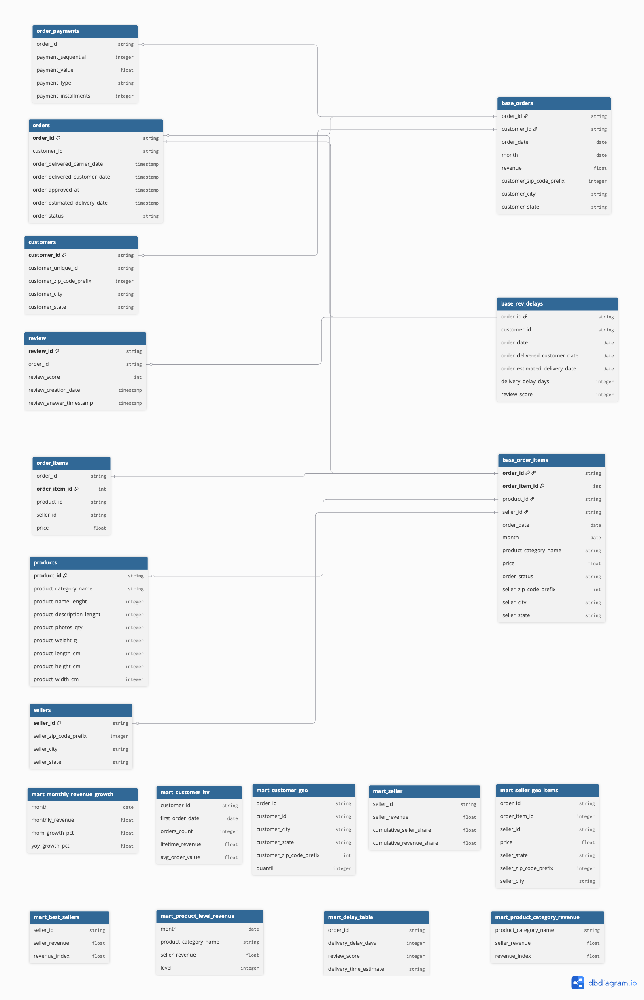

Marketplace Growth & Risk Analysis

BigQuery | SQL | Looker Studio

Olist Marketplace Revenue Analysis

**Overview**
This project analyzes revenue performance and structural dynamics of the Brazilian marketplace Olist (Jan 2017 – Aug 2018).

 • Revenue growth patterns and stabilization
 • Revenue concentration risk
 • Geographic distribution of sellers and customers
 • Identify key sellers;
 • Product category lifecycle behavior
 • Operational impact on customer satisfaction

The analysis was conducted using SQL (Google BigQuery).
The ER diagram was designed in dbdiagram.io, and the dashboard was built in Looker Studio.

**Data Architecture**
## Architecture Overview

This project follows a layered data modeling approach inspired by modern analytical warehouse design:

**RAW → BASE → MART**

- **RAW** — source transactional data (replica of original Olist dataset)
- **BASE** — cleaned, validated and enriched data with derived fields
- **MART** — aggregated analytical tables for business metrics and reporting

This structure ensures:
- clear separation of responsibilities
- data consistency
- scalability for future transformations
- reproducible metric calculations

---

## Entity-Relationship Diagram

  

 
 [View Interactive Version on dbdiagram.io](https://raw.githubusercontent.com/akimovagalina/Olist-Growth-Risk-Analysis/data_model/data_model/db_diagram.png)

  <em>Figure 1. Logical data model illustrating RAW → BASE → MART transformations and key entity relationships.</em>

---

## Interactive Data Model

The full interactive schema is available on dbdiagram:

## Data Architecture

The full ER diagram is available as:

 
 [View Interactive Version on dbdiagram.io](https://raw.githubusercontent.com/akimovagalina/Olist-Growth-Risk-Analysis/data_model/data_model/db_diagram.png)
---

## Layer Responsibilities

### 🔹 RAW Layer
Contains unmodified source data.  
Acts as a single source of truth and allows reprocessing if needed.

### 🔹 BASE Layer
Implements:
- business logic transformations
- date normalization
- revenue calculations
- delivery delay calculations
- entity enrichment (customer & seller geo)

This layer guarantees metric stability.

### 🔹 MART Layer
Provides:
- revenue growth metrics (MoM, YoY, rolling windows)
- customer LTV analytics
- seller performance distribution
- product category revenue ranking
- delivery performance impact on review score

All business KPIs used in reporting are calculated exclusively from MART tables.

## Data Pipeline

The project follows a layered transformation approach:

1. **RAW → BASE**  
   Cleans, validates and enriches transactional data.  
   👉 [View raw_to_base.sql](sql/raw_to_base.sql)

2. **BASE → MART**  
   Aggregates business metrics and prepares analytical tables.  
   👉 [View base_to_mart.sql](sql/base_to_mart.sql)

All KPIs visualized in Looker are calculated in the MART layer.

**Key SQL Techniques**

 • CTEs
 • Multi-table JOINs
 • Window functions (LAG, AVG OVER, NTILE)
 • Month-over-Month growth calculation
 • Date-based aggregations
 • Cumulative revenue distribution (Pareto analysis)

**Data Source**

Data was obtained from the publicly available dataset:
Brazilian E-Commerce Public Dataset by Olist
Source: Kaggle
https://www.kaggle.com/datasets/olistbr/brazilian-ecommerce

The dataset contains anonymized transactional data including:
 • orders
 • order_items
 • customers
 • sellers
 • products
 • reviews
Time range: January 2017 – August 2018.

**Revenue Framework**

Two revenue layers were analyzed:
 • Marketplace Revenue (GMV) — total amount paid by customers
 • Seller Revenue — revenue received by sellers (excluding marketplace markup)
Profitability was not evaluated due to the absence of cost data.

**Key Findings**
 • After rapid expansion in 2017, revenue plateaued in 2018 at ~1.0–1.15M per month. No structural decline is observed; however, growth momentum has slowed, either customer acquisition slowdown or limited expansion into new revenue segments.
 • SP - the state with the highest concentration of sellers and the highest total seller revenue, but Revenue per Seller low compared to other states.
 • 542 top-performing sellers (18% of total sellers) generate 80% of Total Seller Revenue.
 • São Paulo remains the dominant marketplace revenue driver.
 • However, smaller states such as niche high-value regions demonstrate strong CLTV  and potential scalability. 
 • There are 73 product categories in total, of which only 3 for 37% of Seller Revenue.
 • Faster delivery positively impacts review scores.
 • Certain core categories show declining share.

**Risks**

 • High seller concentration
 • Geographic revenue dependency
 • Category maturity and stagnation
 • A decrease in sales in those product categories for which demand has decreased may cause a decrease in overall revenue.

**Opportunities & Strategic Recommendations**

 • Diversify seller base
 • Expand in high-CLTV underpenetrated regions
 • Invest in growing categories
 • Strengthen seller retention programs
 • Improve monitoring of declining segments

**Tools**

Google BigQuery — SQL transformations, window functions, aggregations
Looker Studio — dashboard visualization
dbdiagram.io — data modeling

**Dashboard**

Interactive KPI dashboard built in Looker Studio:
	•	Revenue trends
	•	Customer metrics
	•	Seller distribution
	•	Category performance
	•	Operational KPIs
